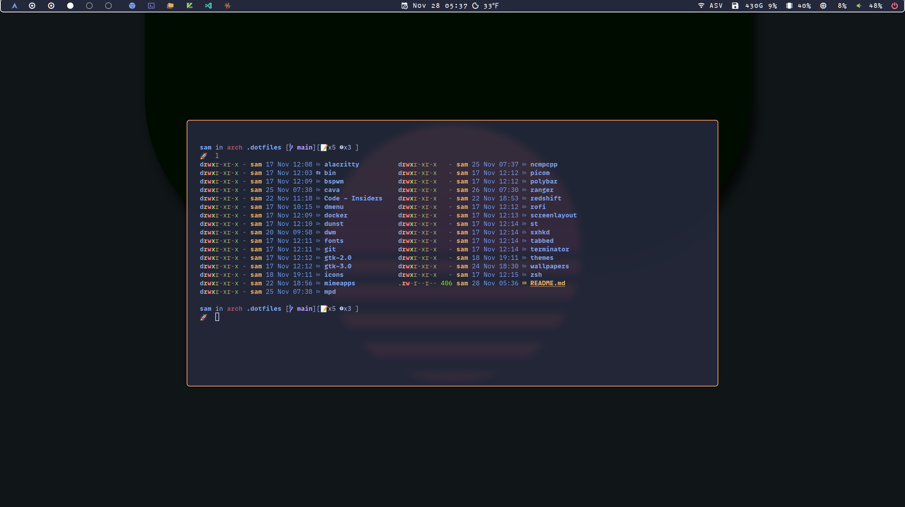
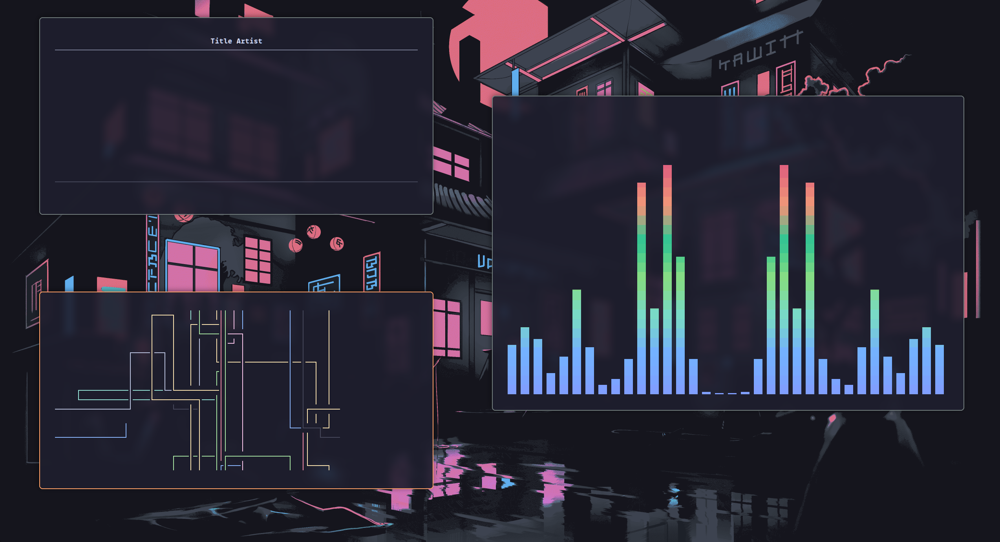
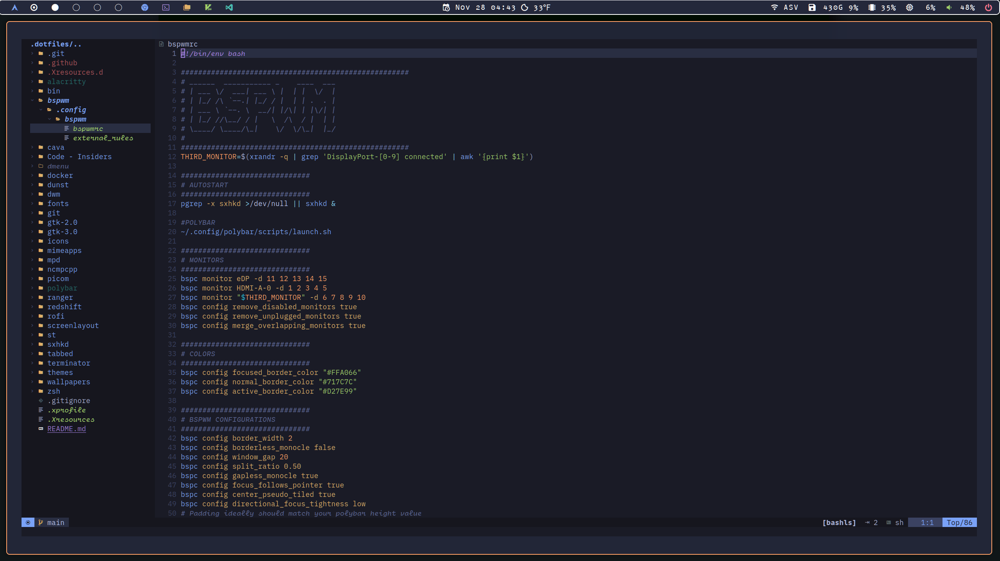

# Still a WIP

Currently, this only supports BSPWM. When time allows, I'll be able to test and configure DWM.

### Polybar

### ScratchPad Alacritty

### Cava + NCMPCPP + Pipes.sh

## LunarVim ScratchPad

